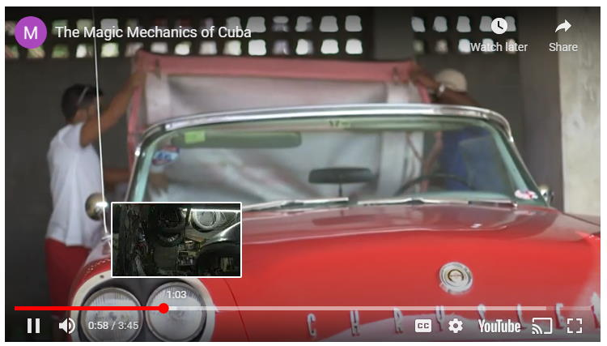

# ArduinoIDE library of Utility functions and ESP8266/ESP32 HAL serving as base of other libraries

---

## Version 0.4.1

[Release Notes](docs/rn030.md)

---

## If you are able, please [Support me on Patreon](https://patreon.com/esparto) and/or subscribe to my [Youtube channel (instructional videos)](https://www.youtube.com/channel/UCYi-Ko76_3p9hBUtleZRY6g)

---


# Contents

* [What does it do?](#what-does-it-do)
* [PMB Tools' place in "The menagerie"](#the-menagerie-roadmap)
* [Why "The Cuban Mechanics" ?](#why-the-cuban-mechanics)
* [Installation](#installation)
* [Issues](#issues)

---

# What does it do?

PMB Tools is at the heart of several other firmware packages that provide for simple *robust* and rapid ***asynchronous*** IOT development on ESP8266 / ESP32.

Firstly it "smooths out" differences in the hardware of ESP8266 / ESP32 that make writing cross-platform code a lot simpler, faster and easier to debug. This type of thing is usually known as a "Hardware Abstraction Layer" or "HAL"

Secondly it provides a few utility functions of the kind that most programmers collect over the years. They usually include / re-write them at the beginning of every project. I make no claims for any of the functions to be special or clever - they are just *my* quirky little way of doing things the way *I* like doing them. They have developed historically and also happen to be called by pretty much every piece of code I write, so - like 'em or not - you gotta have 'em! Finally, there are no doubt many different / better / faster ways of doing some of the tasks: If you think so, then you do them *your* way and spare me any lessons, please.

Perhaps the quickest explanation for this library is to show the *other libraries* that depend on it and where it sits in the grand scheme of rapid development of asynchronous multitasking apps on ESP8266 / ESP32:

# The "menagerie" roadmap

SEE [Installation](#installation)


## The related / dependent libraries

|| Name | Provides | Notes |
| :---: | :----------  | :--- | :--- |
||[Forked AsyncTCP](https://github.com/philbowles/AsyncTCP-master)|"Glue" to LwIP (ESP8266)| Important bugfixes |
||[Forked ESPAsyncTCP](https://github.com/philbowles/ESPAsyncTCP-master)|"Glue" to LwIP(ESP32)| Missing features added |
||[Forked ESPAsyncWebserver](https://github.com/philbowles/ESPAsyncWebServer)| Basis of webUI in H4Plugins| Several major bugfixes |
||[PMB Tools](https://github.com/philbowles/pmbtools)|'32/'8266 HAL and utility functions| |
||[AardvarkTCP](https://github.com/philbowles/AardvarkTCP)|Simple Large-payload Async TCP| API-compatible with ESPAsyncTCP, seamless TLS/SSL |
||[PangolinMQTT](https://github.com/philbowles/PangolinMQTT)|Async MQTT Client|QoS 0/1/2 Fully 3.1.1 compliant. Large payloads |
||[ArmadilloHTTP](https://github.com/philbowles/ArmadilloHTTP)|Async HTTP/S Client| Simple send/callback of large payloads |
||[H4](https://github.com/philbowles/H4)|Scheduler/Async Timers| |
||[H4/Plugins](https://github.com/philbowles/h4plugins)|Full Async IOT Firmware| Webserver, MQTT, OTA, NTP, HTTP etc etc |

---

# API

```cpp
//
//  HAL
//
void                _HAL_feedWatchdog(); // You should NEVER call this - it's here for completenesss  only
uint32_t            _HAL_maxHeapBlock(); // Maxium size of available memory block that can be allocated from heap
size_t              _HAL_maxPayloadSize(); // calculated from 1/2 of the above after subtracting PMB_HEAP_SAFETY
string              _HAL_uniqueName(const string& prefix); // prefix defaults to "ESP8266" or "ESP32", appends unique H/W chip ID
//
//  General purpose / string manipulation
//
// NVP = Name / Value pair refers to a std::map<std::string,std::string>
//
// json refers to "simple json" only: A single, flat hierarchy, anything more complex needs e.g. ArduinoJson lib
//
// While the functions here dela with valid json, they deal only with an extremely limited and specific subset.
//  This can save a LOT of space by avoiding external JSON libraries (e.g. ArduinoJson) where you have control over the input
//  (e.g. from your own internal webserver(s)) and cane ensure:
//  * No arrays
//  * no nesting
//  * no extraneous whitespace
//  * no unquoted values (everything is going to/from std::map<std::string,std::string>
//
// Example:
//  {"name":"phil","firmware":"H4","numeric","666"}
//
void            dumphex(const uint8_t* mem, size_t len); // pretty formatted hex dump len bytes at address mem
string          encodeUTF8(const string &);
string          flattenMap(const map<string,string>& m,const string& fs,const string& rs,function<string(const string&)> f=[](const string& s){ return s; });
string          flattenMap(const unordered_map<string,string>& m,const string& fs,const string& rs,function<string(const string&)> f=[](const string& s){ return s; });
uint32_t        hex2uint(const uint8_t* str); // converts string of x digits to decimal e.g. 02AC becomes 684
string          join(const vector<string>& vs,const char* delim="\n"); // flattens/vector/into/string/delimited/by/whatever/u/want
map<string,string> json2nvp(const string& s); /// takes "simple json" and creates name value / pairs inverse of nvp2json
string          lowercase(string); // does what it says on the tin
string          ltrim(const string& s, const char d=' '); // trims leftmost character(s)
string          nvp2json(const map<string,string>& nvp);// flatens NVP into string representation of simple json inverse of json2nvp
string          replaceAll(const string& s,const string& f,const string& r); // replace all occurrences of f in s with r
string          rtrim(const string& s, const char d=' '); // trims rightmost character(s)
vector<string>  split(const string& s, const char* delimiter="\n"); // decomposes "a/b/c..." into {"a","b","c",...}
string          stringFromInt(int i,const char* fmt="%d"); // ESP8266 does not have C's itoa etc - this does kinda the same job
bool            stringIsAlpha(const string& s); // true if string is entirely "visible ASCII"
bool            stringIsNumeric(const string& s); // true if string will covert to a valid integer
string          trim(const string& s, const char d=' '); // trims both ends, e.g. returs ltrim(rtrim(x))
string          uppercase(string); // DOES WHAT IT SAYS ON THE TINE
string          urlencode(const string &s); // pretty standard
```

---

# Why no example code?

Two reasons:
1) The functions are small, simple and mostly obvious
2) There are dozens of example of usage littered throughout all of the other libraries and example code

---

# Why "The Cuban Mechanics"?

Many moons ago I worked for an organisation that expected my small specialist team to work miracles with practically zero resources. It gave rise to quotes such as:

> We the unwilling, led by the unknowing

> Are doing the impossible for the ungrateful

> We have been doing so much for so long with so little

> We are now qualified to anything with nothing

Around that time (late 1990s) I read an article about Cuba. During the 1950s it was the playground of rich Americans and the streest of Havan were filled with many imported glitzy space-age US automobiles. Once Fidel Castro came to power, ties with the USA were severed and trade embargoes put in place which made it practically impossible to get spares to keep the gas guzzlers running.

Cuban mechanics therefore reapidly became adept at improvisation, creativity, bodging, repurposing and nigh-on miracle working to prevent their cars from going to the scrapyard. They thus became the "poster boys" for my beleagured team who truly identified with them.

Hence the backdrop is the flag of CUBA and the "skull and crossbones" motif is to evoke our team's sense of being "a bit out there". The skull's beard is taken from an actual photo of Fidel Castro and deliberately badly 'shopped in place, signifying the lash=up nature of a lot of things we were forced to end up doing. The "bones" of the map of Cuba and the spanner then speak for themselves.

I actually printed dozens of sticky labels and we'd surreptitiously place them anywhere we could on any piece of kit we rescued, rebuilt, repaired or ~~stole~~ "re-allocated".

Serious IT doesn't have to be *all* po-faced. :)


## More info



[Watch the video](https://nujournalismincuba2018.wordpress.com/2018/07/21/video-the-magician-mechanics-of-cuba/)

---

# Installation

Please see [H4 Installer](https://github.com/philbowles/h4installer)
# Issues

## If you want a *quick* resolution, please follow these rules:

1. As with all H4 and H4Plugins libraries, please make sure you have read *all* the relevant documentation relating to the issue and watched any videos on the [Youtube channel (instructional videos)](https://www.youtube.com/channel/UCYi-Ko76_3p9hBUtleZRY6g). Please also subscribe to the channel for notifications of news and updates.

2. If you still think there is a problem, then join the [Facebook H4  Support / Discussion](https://www.facebook.com/groups/444344099599131/) group and report the issue briefly there. This is because I visit the group every day, whereas I do not have time to visit 11 github repos every day. Furthermore, it alerts other users to potential problems and allows an initial assessment. 

3. If there is a genuine issue then you will be referred to [Raising H4/H4Plugins issues](https://github.com/philbowles/h4plugins/blob/master/docs/issues.md) after which you are advised to create a full github issue report.

4. Failing to make an initial report in the [Facebook H4  Support / Discussion](https://www.facebook.com/groups/444344099599131/) group and simply starting with a github issue, or failing to include all of the information required in [Raising H4/H4Plugins issues](https://github.com/philbowles/h4plugins/blob/master/docs/issues.md) is likely to result in a ***long*** delay before it gets picked up.

---

(c) 2021 Phil Bowles h4plugins@gmail.com

* [Support me on Patreon](https://patreon.com/esparto)
* [Youtube channel (instructional videos)](https://www.youtube.com/channel/UCYi-Ko76_3p9hBUtleZRY6g)
* [Facebook H4  Support / Discussion](https://www.facebook.com/groups/444344099599131/)
* [Facebook General ESP8266 / ESP32](https://www.facebook.com/groups/2125820374390340/)
* [Facebook ESP8266 Programming Questions](https://www.facebook.com/groups/esp8266questions/)
* [Facebook ESP Developers (moderator)](https://www.facebook.com/groups/ESP8266/)